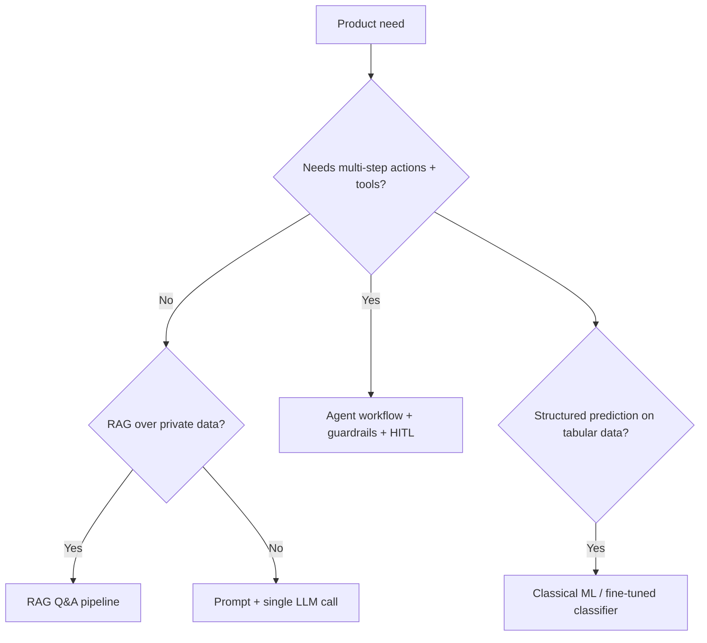

# AI Engineering Manager — Senior Interview Preparation

**Quick access:** [Cheat Sheet](./ai-em-interview-cheat-sheet.md) · [Mock Q&A (full answers)](./ai-em-mock-interview-qa.md)

> **Target role:** AI Engineering Manager (product company)  
> **Squad:** 8–9 AI/ML engineers · **Hands-on:** ~30–40% coding & architecture review  
> **Stack emphasis:** Python, FastAPI, Docker/K8s, **GCP Vertex AI**, MLOps (Kubeflow-style pipelines), NLP/GenAI/agents  

**Companion docs (technical depth):**

- [Guide to AI Agent](./guide-to-ai-agent.md) — agents, RAG, tools, APIs, lifecycle, compliance  
- [Master AI Agent Guide](./master-ai-agent-guide.md) — production architecture, LangGraph, multi-agent, K8s, security  

This document covers what those guides **do not** optimize for: **people leadership**, **roadmaps**, **Vertex/MLOps at manager depth**, and **senior EM system design**.

---

## Table of Contents

1. [How This Interview Differs from IC Roles](#1-how-this-interview-differs-from-ic-roles)
2. [JD → Interview Signal Map](#2-jd--interview-signal-map)
3. [Competency Rubric (What “Pass” Looks Like)](#3-competency-rubric-what-pass-looks-like)
4. [Technical Depth Checklist](#4-technical-depth-checklist)
5. [AI Agents & GenAI (Senior EM Level)](#5-ai-agents--genai-senior-em-level)
6. [GCP Vertex AI & MLOps Partnering](#6-gcp-vertex-ai--mlops-partnering)
7. [ML Lifecycle, CI/CD & Quality Gates](#7-ml-lifecycle-cicd--quality-gates)
8. [KPIs, SLAs & Operating Model](#8-kpis-slas--operating-model)
9. [Roadmap & Product Partnership](#9-roadmap--product-partnership)
10. [Leading an 8–9 Person Squad](#10-leading-an-89-person-squad)
11. [Behavioral & Leadership (STAR Bank)](#11-behavioral--leadership-star-bank)
12. [System Design (Manager-Grade)](#12-system-design-manager-grade)
13. [Case Studies & Whiteboard Scenarios](#13-case-studies--whiteboard-scenarios)
14. [Likely Questions + Model Answer Outlines](#14-likely-questions--model-answer-outlines)
15. [Coding & Architecture Review (30–40% Hands-On)](#15-coding--architecture-review-3040-hands-on)
16. [Questions You Should Ask Them](#16-questions-you-should-ask-them)
17. [14-Day Study Plan](#17-14-day-study-plan)
18. [Day-of Checklist](#18-day-of-checklist)

---

## 1. How This Interview Differs from IC Roles

| Dimension | IC (Senior ML/AI Engineer) | **AI Engineering Manager** |
|-----------|----------------------------|----------------------------|
| **Primary proof** | “I built X” | “My team built X; here’s how I led it” |
| **Depth** | Implementation details | Tradeoffs, standards, delegation, risk |
| **Scope** | Feature / service | Roadmap, hiring, quality bar, stakeholders |
| **Failure stories** | Debugging | Prevention systems, coaching, process |
| **System design** | One service end-to-end | Platform + team + governance + cost |
| **Coding** | Live coding common | Review snippets, design APIs, critique pipelines |

Interviewers are hiring someone who can **ship production AI in a product company** while **scaling humans**, not a pure researcher or a pure people manager.

---

## 2. JD → Interview Signal Map

| JD requirement | What to demonstrate in interview |
|----------------|----------------------------------|
| Lead 8–9 engineers; performance & careers | Hiring plan, 1:1 framework, growth stories, underperformer handling |
| Production AI: prototype → scale | Reference architecture, launch checklist, postmortem |
| Partner MLOps on **Vertex AI** | When Vertex vs custom K8s; pipelines, endpoints, monitoring integration |
| Bridge Product / Data / MLOps / Research | Roadmap negotiation, PRD → epics, research → prod handoff |
| 30–40% hands-on | Recent code/review examples; FastAPI, agents, training pipeline opinions |
| Code quality, ML lifecycle, CI/CD, monitoring | Golden tests, model registry, canary, drift alerts |
| Roadmap with PM; KPIs (accuracy, latency, cost) | Prioritization framework, metric tree, SLA examples |
| R&D time; NLP/embeddings/vector search | Innovation budget, kill criteria for POCs, tech radar |

---

## 3. Competency Rubric (What “Pass” Looks Like)

Rate yourself 1–5 before the loop; aim for **4+** on all rows.

| Competency | Strong signal (4–5) | Weak signal (1–2) |
|------------|---------------------|-------------------|
| **People leadership** | Concrete examples: promoted engineers, fixed toxic dynamics, improved retention | Vague “I believe in empowerment” |
| **Technical judgment** | Clear when **not** to use LLMs; agent vs classical ML | Everything is “throw GPT at it” |
| **Execution** | Shipped on time with phased rollout + evals | Heroics, no metrics |
| **Stakeholder mgmt** | Said no with data; aligned execs on tradeoffs | Blames product or MLOps |
| **MLOps maturity** | Versioned models, reproducible pipelines, incident runbooks | Notebook-only production |
| **Cost & latency** | Unit economics, caching, routing, budgets per feature | Ignores token bill until finance asks |
| **Safety & compliance** | Guardrails, PII, audit logs for agents | “We’ll add security later” |

---

## 4. Technical Depth Checklist

You are not expected to derive backprop on a whiteboard daily, but you **must** speak fluently on:

### NLP & transformers (manager depth)

- **Encoder vs decoder** — BERT-style (understanding) vs GPT-style (generation); when each fits product features.  
- **Embeddings** — semantic search, clustering, dedup; choice of model (dimension, multilingual, domain).  
- **Fine-tuning vs RAG vs prompting** — decision tree (see §5).  
- **Evaluation** — perplexity less useful in prod; task metrics (F1, NDCG, human eval, LLM-as-judge with calibration).  
- **Context limits** — chunking, summarization, long-context models vs retrieval.  

### Classical ML (still relevant in product companies)

- When **gradient boosting / logistic regression** beats deep learning (tabular, small data, interpretability).  
- **Train/serve skew**, data leakage, offline/online metric gaps.  
- **Feature stores** (conceptual) — consistency between training and serving.  

### Software & cloud

- **Python** production patterns: typing, pydantic, async FastAPI, structured logging.  
- **Docker** — multi-stage builds, non-root, image scanning.  
- **Kubernetes** — Deployments, HPA, probes, resource limits, secrets (not env-in-image).  
- **API design** — idempotency, versioning, rate limits, webhook vs poll for long agent jobs.  

### GenAI-specific

- Agents, tool calling, RAG, multi-agent orchestration → [guide-to-ai-agent.md](./guide-to-ai-agent.md), [master-ai-agent-guide.md](./master-ai-agent-guide.md).  

---

## 5. AI Agents & GenAI (Senior EM Level)

### When to use what (say this clearly in interviews)



| Approach | Best for | Risks |
|----------|----------|-------|
| **Prompt only** | Copy, classification, simple extraction | Drift, no grounding |
| **RAG** | Policy/docs Q&A, support, research | Bad chunks, stale index |
| **Agent** | Workflows with tools (CRM, tickets, code) | Cost loops, tool abuse |
| **Fine-tuned model** | Stable format, domain language, high volume | Retrain cost, eval debt |
| **Classical ML** | Fraud, churn, ranking features | Not for free-form chat |

### EM-level agent principles (not IC implementation)

1. **Human-in-the-loop** for irreversible actions (payments, deletes, external comms).  
2. **Max steps / max cost / max time** per workflow — non-negotiable platform defaults.  
3. **Eval harness in CI** before autonomy increases.  
4. **Separate “reasoning” from “execution”** — validated tool layer.  
5. **Tenant isolation** if B2B product.  

### Questions you should answer without notes

- How do you prevent runaway agent loops in production?  
- How do you attribute cost per customer/feature?  
- How do you decide build vs buy (Vertex vs LangChain stack vs internal)?  
- What’s your 90-day plan for a team inheriting a fragile GenAI MVP?  

---

## 6. GCP Vertex AI & MLOps Partnering

Interviewers at product companies often want **practical Vertex fluency**, not generic “we use cloud.”

### Vertex building blocks to name

| Service | Use case |
|---------|----------|
| **Vertex AI Training** | Managed training jobs (custom containers) |
| **Vertex Pipelines** | Kubeflow Pipelines–compatible ML workflows |
| **Model Registry** | Versioned models, stage transitions (staging/prod) |
| **Vertex Endpoints** | Online prediction (GPU/CPU autoscaling) |
| **Feature Store** | Shared features train/serve (if adopted) |
| **Vertex AI Search** | Managed RAG / search (evaluate vs custom vector DB) |
| **Generative AI on Vertex** | Gemini models, tuning, grounding |

### How you partner with MLOps (script for interviews)

> “Product engineering owns **application logic, agents, APIs, and feature-level evals**. MLOps owns **cluster standards, pipeline templates, IAM, cost guardrails, and registry promotion gates**. We meet at **contract boundaries**: container image, model artifact URI, SLO dashboard, and promotion checklist.”

### Build vs buy on GCP

| Need | Often Vertex | Often your K8s / app stack |
|------|--------------|----------------------------|
| Batch training at scale | Vertex Pipelines + Training | — |
| Low-latency custom serving | Vertex Endpoints | Triton on GKE if you need full control |
| GenAI + grounding | Gemini + grounding APIs | LangGraph on Cloud Run/GKE |
| Vector search at huge scale | Vertex AI Search / Matching Engine | Pinecone/pgvector if portable |

### Governance talking points

- **Workload identity** — no long-lived keys in pods.  
- **VPC-SC / private endpoints** — if customer data requires it.  
- **Per-environment projects** — dev/staging/prod separation.  
- **Quota & budget alerts** — per team, per experiment project.  

---

## 7. ML Lifecycle, CI/CD & Quality Gates

### Reference lifecycle (what you enforce as EM)

```
Ideation → PRD + success metrics → Data contract → Experiment (offline) → Eval gate → Staging → Canary → Prod → Monitor → Retrain/iterate
```

### CI/CD for ML (contrast with app CI/CD)

| Gate | Application CI | **ML / GenAI CI** |
|------|----------------|-------------------|
| Unit tests | Functions, APIs | Tool validators, parsers, chunkers |
| Integration | Service + DB | Pipeline smoke, mock LLM |
| Regression | Snapshot tests | **Golden prompts / eval set** |
| Performance | Load test | Latency + token budget |
| Security | SAST | Prompt injection suite, secret scan |
| Promotion | Green main → deploy | **Model registry stage** + metric threshold |

### Artifacts to version

- Code, **Docker image**, **training data snapshot** (or hash), **model weights**, **prompt templates**, **eval datasets**, **embedding index version**.

### Monitoring (beyond uptime)

| Signal | Action |
|--------|--------|
| **Latency p99** | Scale, cache, smaller model routing |
| **Error rate** | Circuit breaker, fallback model |
| **Data drift** | Retrain trigger, alert data team |
| **Prediction drift / quality** | Shadow eval, human review sample |
| **Cost per successful task** | Prompt compression, routing policy |
| **Agent: tool failure rate** | Fix tool or tighten schema |

### Champion “best practices” soundbite

> “No model and no prompt reaches production without a **version**, an **owner**, a **rollback path**, and a **dashboard** with accuracy/latency/cost — same bar as any Tier-1 microservice.”

---

## 8. KPIs, SLAs & Operating Model

### Metric tree (product AI feature)

```
Business KPI (activation, retention, ticket deflection)
    └── Product KPI (task success rate, CSAT, time-to-resolution)
            └── ML/AI KPI (accuracy/groundedness, hallucination rate, escalation rate)
                    └── Engineering KPI (latency p95, availability, cost per task, eval pass rate)
```

### Example SLAs (adjust to domain)

| Feature type | Availability | Latency p95 | Quality |
|--------------|--------------|-------------|---------|
| Sync chat assist | 99.5% | < 3s first token | >85% thumbs-up sample |
| Async agent job | 99% | < 5 min completion | >90% eval pass offline |
| Batch enrichment | Best-effort window | N/A | <0.1% fatal errors |

### Cost KPIs managers own

- **$/successful task**, **$/MAU**, **$/1M tokens** by feature team  
- Budget caps with **degrade path** (cheaper model, disable tool, queue job)  

### Operating cadence (mention you run this)

| Ritual | Cadence | Purpose |
|--------|---------|---------|
| Squad standup | Daily 15m | Blockers, coordination |
| ML/AI review | Weekly | Experiments, eval results, kill/continue |
| Roadmap sync | Biweekly with PM | Priorities, scope cuts |
| Incident review | After SEV | Blameless, action items |
| 1:1s | Weekly | Growth, morale, feedback |
| Tech radar | Quarterly | Embeddings, agents, Vertex features |

---

## 9. Roadmap & Product Partnership

### How you translate PRD → technical roadmap

1. **Clarify user outcome** — not “add AI,” but “reduce support handle time by 20%.”  
2. **Define success metrics** — offline eval + online A/B + guardrails.  
3. **Phase delivery**  
   - **P0:** RAG or scripted assist (low risk)  
   - **P1:** Tool-using agent with HITL  
   - **P2:** Autonomy where evals prove safety  
4. **Explicit non-goals** — what you won’t build this quarter.  
5. **Dependencies** — data quality, legal, MLOps capacity.  

### Prioritization framework (RICE + risk)

| Factor | Question |
|--------|----------|
| **Reach** | How many users/customers? |
| **Impact** | Effect on north-star metric? |
| **Confidence** | Eval + prototype evidence? |
| **Effort** | Eng-weeks including MLOps? |
| **Risk** | Safety, compliance, reputational? |

**Senior EM move:** Kill POCs that fail **pre-defined kill criteria** (e.g. “<70% grounded answers after 2 sprints”) — protects R&D time without politics.

### Handling conflict with Product

**STAR-ready pattern:** Data on eval scores + cost + latency → offer phased option → document decision → commit and revisit with metrics.

---

## 10. Leading an 8–9 Person Squad

### Suggested team topology (product company)

| Sub-area | Typical ownership | Size |
|----------|-------------------|------|
| **Applied ML / NLP** | Ranking, classification, embeddings | 2–3 |
| **GenAI / agents** | RAG, tools, orchestration | 2–3 |
| **ML platform liaison** | Pipelines, serving interfaces (dotted to MLOps) | 1 |
| **Full-stack AI product** | API + UI integration | 1–2 |

You don’t need this exact split — but show you’ve **structured squads intentionally**, not randomly by hire order.

### Hiring bar (3+ years management signal)

- **Loop:** coding/system design + ML depth + leadership + values  
- **Bar raiser:** you defend “no hire” decisions  
- **Diversity:** inclusive panel, structured rubrics, work-sample where possible  

### Performance management (expect these questions)

- How do you **set goals** (OKRs aligned to KPIs)?  
- How do you handle **top vs struggling** performer in same quarter?  
- How do you **delegate** while staying hands-on 30–40%?  
- How do you run **effective code review** culture?  

### Inclusive, collaborative culture (concrete behaviors)

- Rotate **on-call** and **demo days**  
- **Psychological safety** in postmortems  
- **RFC process** for major AI architecture changes  
- **Pairing** seniors with mid-level on agent workflows  

---

## 11. Behavioral & Leadership (STAR Bank)

Prepare **6–8 STAR stories** (2–3 min each). Use this table as a worksheet.

| Theme | Situation prompt | Metrics to include |
|-------|------------------|-------------------|
| **Scaled delivery** | Missed deadline → recovery | Shipped date, defect rate |
| **Hiring** | Built team from X to Y | Time-to-fill, retention |
| **Coaching** | Engineer stuck → promoted | Level change, scope |
| **Conflict** | PM vs eng scope fight | Decision, outcome KPI |
| **Technical bet** | Wrong model/approach → pivot | Eval before/after |
| **Incident** | Prod AI failure | MTTR, prevention |
| **Innovation** | R&D POC → prod or kill | Kill criteria, savings |
| **Cost crisis** | Token bill spike | $ saved, policy change |

### Example STAR skeleton — *underperformer*

- **S:** Engineer missing deadlines on RAG pipeline; team carrying load.  
- **T:** Restore delivery and growth within one quarter.  
- **A:** Clarified expectations, weekly pairing, smaller milestones, escalated blockers to data team.  
- **R:** Feature shipped; engineer back to meeting commitments; kept on team with clear plan.  

### Red-flag answers to avoid

- Taking credit for team work without naming contributors  
- Never saying “I was wrong”  
- Dismissing MLOps or Product as “blockers”  
- No examples of **developing** someone else’s career  

---

## 12. System Design (Manager-Grade)

Expect prompts that blend **platform + people + process**, e.g.:

- “Design the AI layer for a B2B SaaS product with per-tenant agents.”  
- “Design support automation: 50% ticket deflection in 12 months.”  
- “Design ML platform handoff between research and production.”  

### Answer structure (45 minutes)

1. **Requirements** — functional, scale, latency, compliance, budget  
2. **Users & journeys** — sync vs async, HITL points  
3. **High-level diagram** — gateway, orchestrator, models, data, observability  
4. **Data** — OLTP, vector index, event bus, audit log  
5. **Model strategy** — routing, RAG, fine-tune, eval  
6. **Team & process** — who owns what with MLOps  
7. **Rollout** — shadow → canary → full; feature flags  
8. **Failure modes** — injection, drift, cost runaway, vendor outage  
9. **KPIs & SLAs** — metric tree  
10. **Roadmap phases** — 0–90 days  

Deep technical boxes: [master-ai-agent-guide.md](./master-ai-agent-guide.md) §9, §11, §13, §15.

---

## 13. Case Studies & Whiteboard Scenarios

### Case 1 — “Support copilot” (product company classic)

**Prompt:** Reduce median handle time 25% without increasing escalations.

**Strong outline:**

- Phase 1: RAG over KB + draft reply (human sends)  
- Phase 2: Tool access to CRM (read-only) → ticket context  
- Phase 3: Suggested actions with approval  
- Metrics: handle time, CSAT, escalation rate, groundedness eval  
- Risks: wrong policy answers → mandatory citations + confidence threshold  

### Case 2 — “Runaway agent cost”

**Prompt:** One feature 10× token spend after launch.

**Strong outline:**

- Trace analysis (which step loops?)  
- Immediate caps (max steps, daily budget)  
- Router to smaller model for subtasks  
- Prompt compression + cache  
- Postmortem: missing load test with realistic multi-turn sessions  

### Case 3 — “Research → production handoff”

**Prompt:** Research team has SOTA notebook; product wants it in 6 weeks.

**Strong outline:**

- Definition of done: reproducible pipeline, eval set, latency target  
- Joint working group; MLOps template  
- Freeze data schema; containerize training  
- Staging endpoint + shadow traffic before prod  

### Case 4 — “Build vs buy embedding/search”

Compare: Vertex AI Search vs pgvector vs managed Pinecone — on **portability, cost at scale, ops burden, compliance**.

---

## 14. Likely Questions + Model Answer Outlines

### Leadership

**Q: How do you run a team that’s 40% maintenance and 60% new features?**  
> Capacity model per sprint; explicit maintenance budget; rotate “platform champion”; escalate tech debt with $ impact (incidents, slower shipping).

**Q: How do you allocate 10–20% R&D time?**  
> Time-boxed POCs with written hypothesis, kill criteria, and demo; only promote with eval + security review.

**Q: Describe your 1:1 framework.**  
> Career + wellbeing + blockers + feedback; track themes; connect to growth plan; never cancel twice in a row.

### Technical / architectural

**Q: Fine-tune, RAG, or agent — how do you choose?**  
> Use decision tree §5; default RAG before fine-tune; agents only when tools/actions required; fine-tune when format/volume justifies.

**Q: How do you ensure ML quality in CI/CD?**  
> Versioned eval sets, threshold gates, prompt regression tests, canary with automated rollback, human eval sampling in prod.

**Q: Experience with Kubeflow / Vertex Pipelines?**  
> Describe a pipeline: ingest → train → evaluate → register → deploy; parameterize runs; artifact lineage.

### Agent-specific (senior)

**Q: How do you evaluate agents in production?**  
> Offline golden tasks + online task success + tool success rate + cost per success + human review queue for low-confidence.

**Q: How do you prevent prompt injection in a customer-facing agent?**  
> Instruction/data separation, tool allowlists, output validation, no secrets in context, monitoring, red-team suite in CI.

### Business / product

**Q: PM wants GPT-4 for everything; you disagree.**  
> Show cost/latency/quality matrix; propose router; A/B cheaper stack; agree success metric not model name.

**Q: How do you report AI progress to executives?**  
> North-star linkage, phased milestones, risks, $ forecast, not embedding dimension jargon.

---

## 15. Coding & Architecture Review (30–40% Hands-On)

You may **not** get LeetCode hard — expect:

- Review a **FastAPI** endpoint + async job pattern  
- Sketch **agent loop** with max iterations  
- Fix a **pydantic** tool schema  
- Discuss **Dockerfile** hardening  
- Walk through a **K8s Deployment + HPA** YAML  

### Mini FastAPI pattern (know cold)

```python
from fastapi import FastAPI, BackgroundTasks
from pydantic import BaseModel, Field

app = FastAPI()

class AgentRunRequest(BaseModel):
    tenant_id: str
    goal: str = Field(max_length=4000)
    idempotency_key: str

@app.post("/v1/agent/runs")
async def start_run(req: AgentRunRequest, bg: BackgroundTasks):
    # validate authz for tenant_id
    # enqueue workflow; return 202 + run_id
    run_id = enqueue(req)
    return {"run_id": run_id, "status": "queued"}
```

### Code review priorities (state as EM)

1. Correctness & tests  
2. Security (authz on tools, injection)  
3. Observability (trace IDs, structured logs)  
4. Cost guards (timeouts, token limits)  
5. Readability & maintainability  

---

## 16. Questions You Should Ask Them

### Strategy & role

- How is AI Engineering positioned vs **Data Science**, **MLOps**, and **Product**?  
- What does success look like at **6 and 12 months** for this manager?  
- What is already on **Vertex** vs custom GKE?

### Team & culture

- Current squad skills gap — agents vs classical ML vs platform?  
- How much **on-call** for AI incidents?  
- Promotion path and leveling for ML engineers?

### Technical maturity

- Do you have **eval harnesses** and **prompt registry** today?  
- Biggest **production incident** in the last year?  
- **Cost attribution** per feature/customer — exist or greenfield?

### Process

- Who owns **roadmap prioritization** — PM vs EM vs exec?  
- % capacity for **tech debt and R&D**?  
- Model promotion process with MLOps — gates and timelines?

---

## 17. 14-Day Study Plan

| Day | Focus |
|-----|--------|
| 1–2 | Read [guide-to-ai-agent.md](./guide-to-ai-agent.md) §1–15; write your agent/RAG decision tree in your words |
| 3–4 | Read [master-ai-agent-guide.md](./master-ai-agent-guide.md) §1–14; one system design out loud (record yourself) |
| 5 | Vertex AI: Training, Pipelines, Registry, Endpoints, Gemini — 1-page cheat sheet |
| 6 | MLOps: CI/CD gates, monitoring, drift — map to their JD |
| 7 | Prepare 8 STAR stories; practice 2 aloud |
| 8 | Case study: support copilot end-to-end |
| 9 | Case study: cost runaway + governance |
| 10 | KPI/metric tree for a product you know |
| 11 | Mock: “first 90 days as EM” presentation |
| 12 | FastAPI + agent API + K8s review — 2h hands-on |
| 13 | Questions for them + company research |
| 14 | Light review; sleep; no cramming |

---

## 18. Day-of Checklist

- [ ] 6 STAR stories ready (leadership + technical judgment + failure)  
- [ ] One **90-day plan** sketch (listen → assess → quick wins → standards → scale)  
- [ ] Metric tree example for a real product feature  
- [ ] Vertex + MLOps partnership script memorized  
- [ ] Agent vs RAG vs fine-tune decision tree clear  
- [ ] Two system designs practiced (B2B SaaS AI + support automation)  
- [ ] Questions for hiring manager written down  
- [ ] Stories name **team outcomes**, not solo heroics  

---

## First 90 Days (if they ask “how would you start?”)

| Days | Actions |
|------|---------|
| **1–30** | 1:1s with every engineer; shadow on-call; inventory models/prompts/evals; align with PM on KPIs |
| **31–60** | Ship one **reliability** win (eval in CI, cost dashboard, or incident runbook); clarify RACI with MLOps |
| **61–90** | Roadmap v1 with phased AI delivery; hiring plan if gaps; team working agreements (review, RFC, on-call) |

---

## Honest readiness check

| If you only… | Likely outcome |
|--------------|----------------|
| Read all 3 MD files | Strong **theory**; weak **leadership proof** without STAR practice |
| Read + 2 mocks + 1 project story | Competitive for **many** EM loops |
| Read + led 8+ person team + shipped GenAI prod | Strong candidate |

**This role is not “agent trivia.”** Interviewers weight **judgment, delivery, people, and production discipline** as much as LangGraph details.

---

## Quick links

| Resource | Use for |
|----------|---------|
| [guide-to-ai-agent.md](./guide-to-ai-agent.md) | RAG, tools, APIs, testing, compliance |
| [master-ai-agent-guide.md](./master-ai-agent-guide.md) | Architecture, LangGraph, K8s, security, IC system design |
| **This doc** | EM leadership, Vertex/MLOps, roadmap, KPIs, behavioral |


---

## Corpus coverage — is this enough to pass?

### What you have in `AIML/`

| Resource | Best for |
|----------|----------|
| [guide-to-ai-agent.md](./guide-to-ai-agent.md) | Agent/RAG/tools/APIs/lifecycle |
| [master-ai-agent-guide.md](./master-ai-agent-guide.md) | Production architecture, LangGraph, K8s, security |
| [ai-engineering-manager-interview-prep.md](./ai-engineering-manager-interview-prep.md) | EM leadership, Vertex, roadmaps, behavioral |
| [ai-em-interview-cheat-sheet.md](./ai-em-interview-cheat-sheet.md) | Last-minute review |
| [ai-em-mock-interview-qa.md](./ai-em-mock-interview-qa.md) | Full spoken answers |
| `TowerResearch/` | AI **Ops/FinOps** (cost, Bedrock, chargeback) — **adjacent**, not a substitute for product EM |

### Realistic readiness (honest)

| Role | Docs alone | Docs + mocks + your experience |
|------|------------|--------------------------------|
| **AI Engineering Manager** (product) | ~50–60% | **Strong** if you have 3+ yrs managing ML/AI engineers + shipped GenAI/ML |
| **Senior architect** (AI/platform) | ~40–50% | **Strong** if you add platform ADRs, multi-team influence, deep distributed systems stories |
| **Tower-style AI Ops Manager** | Tower folder essential | EM/agent docs help on agents; **not** enough without FinOps depth |

### Gaps to fill outside markdown

1. **Your STAR stories** with real names replaced, real metrics  
2. **2–3 live system designs** timed to 45 minutes  
3. **Company-specific** research (their product, stack, competitors)  
4. **Architect loops:** evolutionary architecture, multi-tenancy, ADRs, API/platform strategy (see [Mock Q&A — Architect variant](./ai-em-mock-interview-qa.md#architect--senior-architect-variant--extra-questions))  
5. Optional: 1 small hands-on refresh (FastAPI + eval fixture) if coding round expected  

Reading everything without practice is rarely enough for **senior** loops; reading + mocks + experience is.


Good luck — prepare stories, metrics, and tradeoffs, not just definitions.
