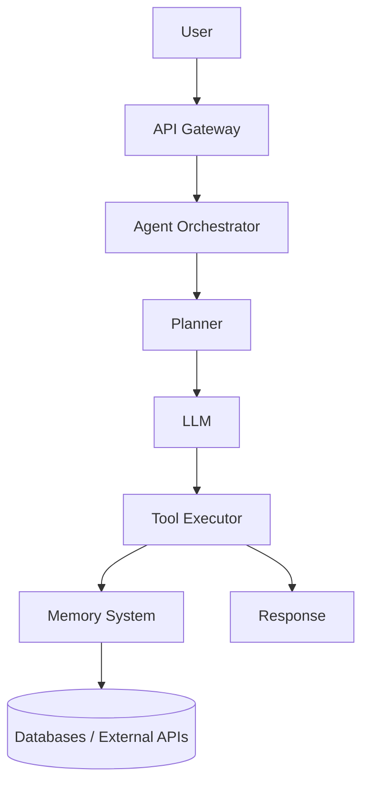

# Complete End-to-End AI Agent Engineering Guide

> A practical reference for designing, building, securing, and operating production AI agents—from first prototype to enterprise deployment.

**Related:**

- [Master AI Agent Guide](./master-ai-agent-guide.md) — advanced architecture, LangGraph, Kubernetes, security  
- [AI Engineering Manager Interview Prep](./ai-engineering-manager-interview-prep.md) — senior EM loop (leadership, Vertex AI, MLOps, roadmaps)

---

## Table of Contents

1. [Introduction to AI Agents](#1-introduction-to-ai-agents)
2. [Types of AI Agents](#2-types-of-ai-agents)
3. [AI Agent Architecture](#3-ai-agent-architecture)
4. [Core Components](#4-core-components)
5. [Choosing the Right Tech Stack](#5-choosing-the-right-tech-stack)
6. [Designing Agent Workflows](#6-designing-agent-workflows)
7. [Prompt Engineering](#7-prompt-engineering)
8. [Memory Systems](#8-memory-systems)
9. [Tool Calling and Function Execution](#9-tool-calling-and-function-execution)
10. [Retrieval-Augmented Generation (RAG)](#10-retrieval-augmented-generation-rag)
11. [Planning and Reasoning Systems](#11-planning-and-reasoning-systems)
12. [Multi-Agent Systems](#12-multi-agent-systems)
13. [Security and Guardrails](#13-security-and-guardrails)
14. [Observability and Monitoring](#14-observability-and-monitoring)
15. [Evaluation Frameworks](#15-evaluation-frameworks)
16. [AI Agent Code Structure](#16-ai-agent-code-structure)
17. [Backend Architecture](#17-backend-architecture)
18. [Frontend Architecture](#18-frontend-architecture)
19. [Database Design](#19-database-design)
20. [Queue and Event Systems](#20-queue-and-event-systems)
21. [API Design](#21-api-design)
22. [Authentication and Authorization](#22-authentication-and-authorization)
23. [AI Model Selection](#23-ai-model-selection)
24. [Deployment Architecture](#24-deployment-architecture)
25. [Kubernetes Deployment](#25-kubernetes-deployment)
26. [CI/CD for AI Agents](#26-cicd-for-ai-agents)
27. [Cost Optimization](#27-cost-optimization)
28. [Scaling Strategies](#28-scaling-strategies)
29. [Enterprise AI Agent Design](#29-enterprise-ai-agent-design)
30. [Real-World AI Agent Examples](#30-real-world-ai-agent-examples)
31. [AI Agent Development Lifecycle](#31-ai-agent-development-lifecycle)
32. [Testing Strategies](#32-testing-strategies)
33. [Logging and Tracing](#33-logging-and-tracing)
34. [AI Safety](#34-ai-safety)
35. [AI Compliance](#35-ai-compliance)
36. [Production Readiness Checklist](#36-production-readiness-checklist)
37. [Team Structure](#37-team-structure)
38. [Documentation Standards](#38-documentation-standards)
39. [Teaching Others AI Agents](#39-teaching-others-ai-agents)
40. [Advanced Topics](#40-advanced-topics)
41. [Future of AI Agents](#41-future-of-ai-agents)
42. [Model Context Protocol (MCP)](#42-model-context-protocol-mcp)
43. [Quick Reference](#43-quick-reference)

---

## 1. Introduction to AI Agents

### What is an AI Agent?

An **AI agent** is a software system that:

- Understands goals (not just the latest user message)
- Makes decisions under uncertainty
- Uses tools and external systems
- Maintains memory across turns and sessions
- Executes multi-step actions
- Improves from feedback, evaluation, or human correction

| Pattern | Flow |
|--------|------|
| **Traditional software** | Input → deterministic logic → Output |
| **AI agent** | Goal → reasoning → planning → tool usage → action → feedback → improvement |

### Agent vs. chatbot

| Dimension | Chatbot | AI agent |
|-----------|---------|----------|
| **Goal** | Respond to messages | Achieve an outcome |
| **Tools** | Rarely | Core capability |
| **State** | Often session-only | Short + long-term memory |
| **Planning** | Single turn | Multi-step plans |
| **Autonomy** | Low | Configurable (human-in-the-loop to fully autonomous) |
| **Failure mode** | Wrong answer | Wrong action in production |

### When to use an agent

Use an agent when the task requires **combining reasoning with side effects** (API calls, DB writes, file changes, approvals). Use a simple LLM call or RAG Q&A when the task is **read-only Q&A** with no orchestration.

---

## 2. Types of AI Agents

### 2.1 Reactive agents

- No persistent memory
- Immediate response
- Rule-based or single-shot LLM

**Examples:** FAQ chatbot, alert triage bot, status lookup.

### 2.2 Goal-based agents

- Work toward explicit objectives
- Decompose goals into subtasks

**Examples:** Travel planner, research assistant, incident summarizer.

### 2.3 Utility-based agents

- Compare options and optimize a score (cost, risk, revenue)

**Examples:** Trading assistants, recommendation engines, routing optimizers.

### 2.4 Learning agents

- Improve from data, evals, or human feedback (RLHF, DPO, online learning)

**Examples:** Fraud detection, personalized tutoring, support tone adaptation.

### 2.5 Autonomous agents

- Operate with minimal supervision across long horizons

**Examples:** DevOps remediation, customer support automation, batch research pipelines.

> **Design tip:** Start reactive or goal-based; add autonomy only after observability, guardrails, and evals are in place.

---

## 3. AI Agent Architecture

### Standard request path



### Layer responsibilities

| Layer | Responsibility |
|-------|----------------|
| **API Gateway** | Auth, rate limits, routing |
| **Orchestrator** | Session, workflow state, retries |
| **Planner** | Task breakdown, routing |
| **LLM** | Reasoning and language |
| **Tool executor** | Validated side effects |
| **Memory** | Context retrieval and persistence |

---

## 4. Core Components

### 4.1 LLM layer

**Purpose:** reasoning, understanding, generation.

**Examples:** GPT, Claude, Gemini, Llama (hosted or self-hosted).

Choose models by: task complexity, latency budget, tool-calling quality, context window, and cost per million tokens.

### 4.2 Tool layer

Capabilities exposed to the model:

- Web search, RAG retrieval
- Database queries (read-only by default)
- APIs (email, calendar, payments)
- Code execution (sandboxed)
- File read/write (scoped paths)

### 4.3 Memory layer

| Type | Scope | Storage |
|------|--------|---------|
| **Short-term** | Current conversation | Redis / in-process buffer |
| **Long-term** | User/org facts | PostgreSQL + embeddings |
| **Vector** | Semantic recall | Pinecone, Weaviate, pgvector |
| **Episodic** | Past runs and outcomes | Event store / audit DB |

### 4.4 Planning engine

Breaks goals into ordered or parallel tasks.

**Example goal:** “Create quarterly sales report”

1. Fetch sales data (tool)
2. Analyze trends (LLM + code)
3. Generate charts (tool)
4. Write executive summary (LLM)
5. Export PDF (tool)

---

## 5. Choosing the Right Tech Stack

### Backend

| Language | Best for |
|----------|----------|
| **Python** | AI-heavy systems, LangGraph, rapid iteration |
| **Golang** | High-throughput orchestration, low-latency tool routing |
| **Node.js** | Full-stack teams, real-time UI |

**Common pattern:** Python for agent logic + Golang for gateway/workers, or a single Python FastAPI monolith until scale demands split.

### Frontend

- **React / Next.js** — dashboards, chat, admin
- **React Native** — mobile field agents

### Databases

| Category | Options |
|----------|---------|
| Relational | PostgreSQL, MySQL |
| Document | MongoDB |
| Vector | Pinecone, Weaviate, Milvus, ChromaDB, pgvector |
| Cache | Redis |

### Queues and cloud

- **Queues:** Kafka, RabbitMQ, Google Pub/Sub, SQS
- **Cloud:** AWS, GCP, Azure (pick what your org already operates)

---

## 6. Designing Agent Workflows

### Deterministic + AI hybrid

Use AI only where judgment is needed; keep business rules in code.

| Approach | Verdict |
|----------|---------|
| LLM does everything | Fragile, expensive, hard to test |
| Code validates + LLM reasons | Production default |

### Workflow stages

```
Input → Validation → Intent detection → Planning → Execution → Verification → Response
```

### Idempotency and retries

- Assign **workflow IDs** and **step IDs** for every run
- Make tools **idempotent** where possible (e.g. `upsert` with client token)
- Retry transient failures; **never** blindly retry payments or deletes without deduplication

---

## 7. Prompt Engineering

### System prompt

Defines identity, rules, constraints, and tone.

```text
You are a banking compliance assistant. You never provide legal advice.
You cite internal policy IDs. You refuse requests that bypass audit logging.
```

### Prompt structure (recommended)

1. **Role** — who the agent is  
2. **Context** — user, tenant, session facts  
3. **Task** — what to do now  
4. **Constraints** — what is forbidden  
5. **Examples** — few-shot (optional)  
6. **Output format** — JSON, markdown, structured fields  

### Techniques

| Technique | Use when |
|-----------|----------|
| Zero-shot | Simple, well-defined tasks |
| Few-shot | Format or style must be exact |
| Chain-of-thought | Multi-step reasoning |
| ReAct | Reason + call tools in loop |
| Self-reflection | Quality gate before user sees output |

---

## 8. Memory Systems

### 8.1 Conversation memory

Store user messages, assistant messages, and tool I/O with timestamps and token counts for truncation policies.

### 8.2 Semantic memory

Embed text → store in vector DB → retrieve by similarity at query time.

### 8.3 Episodic memory

Store past tasks, outcomes, and human corrections (“last time we used X template for Y client”).

### Memory retrieval flow

```
User input → Embed → Vector search (top-k) → Rerank → Inject into prompt context
```

### Context window management

- **Summarize** old turns instead of dropping silently  
- **Pin** system facts (user name, tenant policy) outside the rolling window  
- **Budget** tokens: reserve headroom for tool results and model output  

---

## 9. Tool Calling and Function Execution

### What are tools?

Structured functions the model can invoke—defined with names, descriptions, and JSON schemas.

### Tool design principles

1. **Single responsibility** — one tool, one job  
2. **Deterministic output** — stable schemas for tests  
3. **Validate all parameters** — never trust raw LLM output for SQL or shell  
4. **Least privilege** — read-only DB roles, scoped API keys  

### Example tool schema (OpenAI-style)

```json
{
  "name": "search_knowledge_base",
  "description": "Search internal docs for policies and procedures.",
  "parameters": {
    "type": "object",
    "properties": {
      "query": { "type": "string", "description": "Natural language search query" },
      "top_k": { "type": "integer", "minimum": 1, "maximum": 20, "default": 5 }
    },
    "required": ["query"]
  }
}
```

### Execution flow

```
User question → LLM selects tool → Executor validates → Tool runs → Result to LLM → Final answer
```

### Human-in-the-loop

Require approval for: payments, PII export, production deploys, privilege escalation, bulk deletes.

---

## 10. Retrieval-Augmented Generation (RAG)

### Why RAG?

LLMs can hallucinate and lack private, up-to-date data. RAG grounds answers in your corpus.

### RAG pipeline

```
Documents → Chunk → Embed → Index → Query embed → Retrieve → (Rerank) → LLM with context
```

### Chunking strategies

| Strategy | Pros | Cons |
|----------|------|------|
| Fixed size | Simple | Splits mid-sentence |
| Semantic | Better coherence | Higher compute |
| Hierarchical | Parent/child for long docs | More complex indexing |

### Embedding models (examples)

OpenAI `text-embedding-3-*`, BGE, E5, Instructor — benchmark on **your** domain.

### Minimal retrieval snippet (conceptual)

```python
def retrieve(query: str, index, k: int = 5) -> list[str]:
    vector = embed(query)
    chunks = index.similarity_search(vector, k=k)
    return [c.text for c in chunks]
```

### RAG quality levers

- Metadata filters (tenant, date, doc type)
- Hybrid search (BM25 + vector)
- Rerankers (cross-encoder)
- Citation requirements in the system prompt

---

## 11. Planning and Reasoning Systems

| Approach | Description |
|----------|-------------|
| **Chain-of-thought** | Linear step reasoning |
| **Tree-of-thought** | Branch and prune options |
| **Graph planning** | LangGraph / state machines for long workflows |

### Reflection systems

A **critic** or **reviewer** node checks accuracy, safety, and completeness before delivery.

---

## 12. Multi-Agent Systems

### Why multiple agents?

Specialists beat one giant prompt: better accuracy, clearer ownership, independent scaling.

| Agent | Role |
|-------|------|
| Planner | Decompose work |
| Researcher | Fetch and summarize |
| Coder | Implement changes |
| Reviewer | Validate output |
| Security | Scan for policy violations |

### Coordinator pattern

```
User → Coordinator → [parallel specialists] → Aggregator → User
```

See [Master AI Agent Guide](./master-ai-agent-guide.md#5-multi-agent-system-design) for communication models (centralized, decentralized, blackboard).

---

## 13. Security and Guardrails

### Risks

- Prompt injection and jailbreaking  
- Data leakage (PII, secrets in context)  
- Tool abuse (SSRF, SQL injection via “generated” queries)  
- Hallucinations presented as fact  

### Defense in depth

| Layer | Controls |
|-------|----------|
| Input | Sanitize, allowlists, rate limits |
| Tools | Whitelist, param validation, sandbox |
| Output | Moderation, PII redaction |
| Process | Human approval on high-risk actions |

### AI firewall

Block unsafe prompts, exfiltration patterns, and instruction override attempts before they reach the planner.

---

## 14. Observability and Monitoring

### What to track

| Category | Examples |
|----------|----------|
| **Metrics** | Latency, tokens, cost, error rate, tool success |
| **Logs** | Prompt hash, tool args (redacted), outcomes |
| **Traces** | End-to-end spans per workflow step |

### Recommended tools

LangSmith, OpenTelemetry, Grafana, Prometheus, Loki, Jaeger, Datadog.

### AI-specific signals

- Groundedness vs. retrieved docs  
- Citation coverage  
- User thumbs up/down correlated to trace ID  

---

## 15. Evaluation Frameworks

### Dimensions

| Dimension | Question |
|-----------|----------|
| **Accuracy** | Is the answer correct? |
| **Groundedness** | Supported by retrieved sources? |
| **Safety** | Policy violations? |
| **Latency** | Within SLO? |
| **Cost** | Within budget per task? |

### Eval types

- **Offline:** golden datasets, LLM-as-judge (with human calibration)  
- **Online:** A/B prompts, shadow traffic, canary models  
- **Adversarial:** injection suites, tool misuse attempts  

### Example golden case

```yaml
input: "What is our refund policy for enterprise tier?"
expected_contains: ["30-day", "written approval"]
tools_allowed: ["search_knowledge_base"]
max_cost_usd: 0.05
```

---

## 16. AI Agent Code Structure

### Recommended enterprise layout

```
ai-agent-platform/
├── cmd/server/
├── internal/
│   ├── agents/
│   ├── planner/
│   ├── memory/
│   ├── tools/
│   ├── prompts/
│   ├── rag/
│   ├── models/
│   ├── workflows/
│   ├── observability/
│   ├── auth/
│   └── config/
├── pkg/
├── api/
├── deployments/
├── scripts/
├── docs/
├── tests/
└── ui/
```

---

## 17. Backend Architecture

```
Controller → Service → Agent Orchestrator → Repositories → Databases
```

Keep **orchestration** separate from **HTTP handlers** so the same workflow runs from API, queue, or CLI.

---

## 18. Frontend Architecture

**Recommended surfaces:**

- Chat with streaming and tool-call transparency  
- Agent dashboard (runs, failures, retries)  
- Workflow graph viewer  
- Logs and trace links  
- Cost analytics per tenant/user  
- Memory explorer (what the agent “knows”)  

---

## 19. Database Design

| Store | Holds |
|-------|--------|
| **Operational DB** | Users, sessions, workflows, approvals |
| **Vector DB** | Chunks + embeddings + metadata |
| **Analytics** | Aggregated metrics, eval results |

**Always** store audit logs for tool calls and admin actions.

---

## 20. Queue and Event Systems

Long-running agent work should be **async**:

| Event | Consumer action |
|-------|-----------------|
| `TaskCreated` | Start workflow |
| `ToolExecuted` | Update trace, billing |
| `AgentCompleted` | Notify user, webhook |
| `ErrorOccurred` | Retry or DLQ |

---

## 21. API Design

| Method | Path | Purpose |
|--------|------|---------|
| POST | `/chat` | Streaming conversation |
| POST | `/agent/run` | Start workflow |
| GET | `/tasks/{id}` | Poll status |
| POST | `/memory/search` | Debug retrieval |
| POST | `/documents/upload` | Ingest for RAG |

Use **idempotency keys** on `POST` that trigger side effects.

---

## 22. Authentication and Authorization

- **Auth:** OAuth2, JWT, SSO (OIDC)  
- **AuthZ:** RBAC — Admin, Operator, Viewer; plus **tool-level** scopes per role  

Map tenant ID through every layer for isolation.

---

## 23. AI Model Selection

| Factor | Notes |
|--------|-------|
| Cost | Input vs. output token pricing |
| Accuracy | Benchmark on your tasks |
| Speed | TTFT and tokens/sec |
| Context | Long docs need large windows |
| Tools | Native function calling quality |

**Router pattern:** small model for classification/routing, large model for hard reasoning.

---

## 24. Deployment Architecture

```
Load balancer → API gateway → Agent services → Queues → DBs → Monitoring
```

Run tool executors in **network-restricted** subnets; no open egress by default.

---

## 25. Kubernetes Deployment

- **Deployments** — stateless API and workers  
- **StatefulSets** — vector DBs when self-hosted  
- **Ingress** — TLS termination  
- **HPA** — scale on queue depth and CPU  
- **ConfigMaps / Secrets** — prompts and API keys (prefer external secret manager)  

---

## 26. CI/CD for AI Agents

```
Commit → Unit tests → Prompt/regression evals → Security scan → Build image → Deploy → Smoke + canary evals
```

Treat **prompt changes** like code: version, review, and run golden tests.

---

## 27. Cost Optimization

Largest cost drivers: LLM tokens, vector storage, GPU inference.

| Tactic | Impact |
|--------|--------|
| Response caching | High for repeated FAQs |
| Smaller models for subtasks | High |
| Prompt compression | Medium |
| Batch inference | High for offline jobs |
| Token budgets per session | Prevents runaway loops |

---

## 28. Scaling Strategies

- **Horizontal:** more API replicas and worker pools  
- **Async:** queue-backed long tasks  
- **Partition:** per-tenant queues for noisy neighbors  

---

## 29. Enterprise AI Agent Design

**Requirements:** audit logs, compliance, security, explainability, governance.

**Banking examples:** fraud detection, KYC validation, AML monitoring, compliant customer support (with retrieval from approved policy corpuses only).

---

## 30. Real-World AI Agent Examples

### 30.1 Customer support agent

Ticket classification → RAG from KB → draft reply → human approve → send.

### 30.2 Coding agent

Repo index → plan → patch → test → security review → PR.

### 30.3 Research agent

Web + internal docs → summarize → citations → reviewer pass.

---

## 31. AI Agent Development Lifecycle

```
Requirements → Architecture → Prompts → Tools → Memory → Build → Test → Eval → Deploy → Monitor → Improve
```

Ship **eval harness** before increasing autonomy.

---

## 32. Testing Strategies

| Type | Target |
|------|--------|
| Unit | Tools, validators, parsers |
| Integration | Full graph with mocked LLM |
| Prompt | Golden outputs, regression |
| Adversarial | Injection, tool escape |
| Load | Queue backlog, token throughput |

---

## 33. Logging and Tracing

Log (with redaction): user query ID, prompt version, tool calls, model ID, latency, token cost, outcome.

Correlate with **trace ID** across services.

---

## 34. AI Safety

- Hallucination detection (citation required)  
- PII masking in logs and prompts  
- Injection defenses  
- Human review for irreversible actions  

---

## 35. AI Compliance

| Regulation | Agent implication |
|------------|-------------------|
| GDPR | Data minimization, deletion, EU residency |
| HIPAA | PHI handling, BAA with vendors |
| SOC2 | Access control, audit trails |
| PCI-DSS | Never pass card data through prompts |

---

## 36. Production Readiness Checklist

- [ ] Retries, timeouts, circuit breakers  
- [ ] Encryption at rest and in transit  
- [ ] Secrets in vault, not env files in images  
- [ ] Autoscaling and queue backpressure  
- [ ] Dashboards: latency, errors, cost per tenant  
- [ ] Runbooks for model outage and rate limits  
- [ ] Eval suite in CI  
- [ ] Incident response for harmful outputs  

---

## 37. Team Structure

AI engineers, backend engineers, ML engineers, DevOps, security, product—shared **prompt library** and **tool catalog** owned collaboratively.

---

## 38. Documentation Standards

Maintain: architecture doc, OpenAPI specs, prompt registry, tool catalog, security guidelines, on-call runbooks.

---

## 39. Teaching Others AI Agents

| Level | Topics |
|-------|--------|
| Beginner | LLM basics, prompt engineering |
| Intermediate | RAG, tools, memory |
| Advanced | Multi-agent, security, scale |

**Hands-on path:** chatbot → RAG assistant → tool agent → workflow agent → multi-agent platform.

---

## 40. Advanced Topics

- Agentic RAG (retrieve during reasoning, not once)  
- Autonomous planning with checkpoints  
- Model Context Protocol (MCP) for tool discovery  
- RL / preference learning from production feedback  
- Self-improving agents (with strict eval gates)  

---

## 41. Future of AI Agents

Trends: AI coworkers, autonomous enterprise workflows, AI-native apps, human-in-the-loop by default, self-healing ops with bounded autonomy.

---

## 42. Model Context Protocol (MCP)

**MCP** standardizes how agents discover and call tools hosted by external servers (IDEs, databases, SaaS).

**Benefits:**

- Consistent tool schemas across products  
- Separation between agent runtime and tool providers  
- Easier security review per server  

**Production pattern:** allowlist MCP servers per tenant; audit every `call_tool`; never pass secrets through model context.

---

## 43. Quick Reference

### Frameworks

LangChain, LangGraph, CrewAI, AutoGen, Semantic Kernel, LangChainGo (Golang).

### Learning resources

- Provider docs: OpenAI, Anthropic, Google AI  
- [Master AI Agent Guide](./master-ai-agent-guide.md) — production structure, K8s, interviews  

### Final advice

1. Master backend and distributed systems  
2. Build production systems early  
3. Invest in observability and security  
4. Evaluate continuously  
5. Prefer small, testable workflows over one mega-prompt  

The best agents combine **strong engineering**, **reliable infrastructure**, **grounded reasoning**, **secure execution**, and **human oversight** where it matters.
