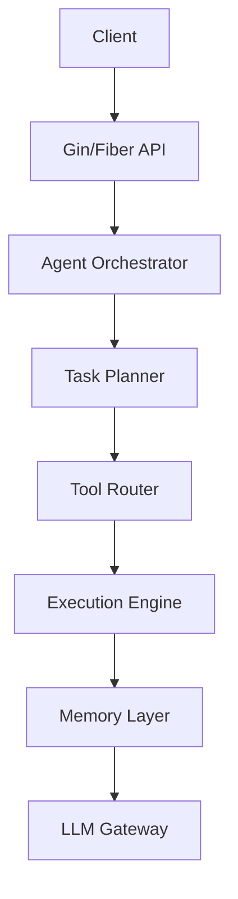
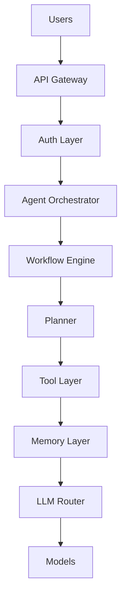

# Advanced AI Agent Engineering — Master Guide

> Production patterns for folder structure, Golang/Python stacks, LangGraph, multi-agent design, security, SaaS, Kubernetes, and system design interviews.

**Related:** See [Guide to AI Agent](./guide-to-ai-agent.md) for end-to-end fundamentals, RAG, APIs, compliance, and the development lifecycle.

---

## Table of Contents

1. [Production-Grade Folder Structure](#1-production-grade-ai-agent-folder-structure)
2. [Golang AI Agent Framework](#2-golang-ai-agent-framework-architecture)
3. [Python AI Agent Framework](#3-python-ai-agent-framework-architecture)
4. [LangGraph Full Tutorial](#4-langgraph-full-tutorial)
5. [Multi-Agent System Design](#5-multi-agent-system-design)
6. [Interview Preparation](#6-ai-agent-interview-preparation-guide)
7. [Learning Roadmap](#7-ai-agent-roadmap-beginner-to-expert)
8. [Project Ideas](#8-ai-agent-project-ideas)
9. [Enterprise Architecture](#9-enterprise-ai-agent-architecture-diagrams)
10. [Security Handbook](#10-ai-agent-security-handbook)
11. [SaaS Architecture](#11-ai-agent-saas-architecture)
12. [Observability](#12-ai-agent-observability-guide)
13. [Kubernetes Deployment](#13-ai-agent-deployment-on-kubernetes)
14. [System Design Interviews](#14-ai-agent-system-design-interview-guide)
15. [End-to-End Sample Project](#15-end-to-end-ai-agent-sample-project)
16. [Production Best Practices](#16-production-best-practices)
17. [Common Failures](#17-common-failures-and-lessons)
18. [Future Trends](#18-future-architecture-trends)
19. [Appendix: Decision Matrices](#19-appendix-decision-matrices)

---

## 1. Production-Grade AI Agent Folder Structure

Enterprise agents benefit from a **monorepo** with clear boundaries: agents, workflows, LLM routing, tools, RAG, security, and observability as first-class packages.

```
ai-platform/
├── cmd/
│   ├── api-server/
│   ├── worker/
│   ├── scheduler/
│   └── cli/
├── internal/
│   ├── agents/
│   │   ├── planner/
│   │   ├── researcher/
│   │   ├── coder/
│   │   ├── reviewer/
│   │   ├── summarizer/
│   │   └── orchestrator/
│   ├── workflows/
│   │   ├── state_machine/
│   │   ├── graph_execution/
│   │   └── pipeline/
│   ├── llm/
│   │   ├── openai/
│   │   ├── anthropic/
│   │   ├── gemini/
│   │   ├── ollama/
│   │   └── router/
│   ├── prompts/
│   │   ├── system/
│   │   ├── templates/
│   │   ├── fewshot/
│   │   └── guardrails/
│   ├── memory/
│   │   ├── conversation/
│   │   ├── vector/
│   │   ├── episodic/
│   │   └── semantic/
│   ├── tools/
│   │   ├── websearch/
│   │   ├── database/
│   │   ├── filesystem/
│   │   ├── email/
│   │   ├── calendar/
│   │   ├── payment/
│   │   └── execution/
│   ├── rag/
│   │   ├── chunking/
│   │   ├── embeddings/
│   │   ├── retrieval/
│   │   ├── reranking/
│   │   └── indexing/
│   ├── security/
│   │   ├── pii/
│   │   ├── injection/
│   │   ├── moderation/
│   │   ├── audit/
│   │   └── encryption/
│   ├── observability/
│   │   ├── tracing/
│   │   ├── metrics/
│   │   ├── logging/
│   │   └── alerting/
│   ├── queues/
│   ├── auth/
│   ├── config/
│   ├── db/
│   └── cache/
├── deployments/
│   ├── kubernetes/
│   ├── terraform/
│   ├── helm/
│   └── docker/
├── api/
│   ├── grpc/
│   ├── rest/
│   └── websocket/
├── docs/
├── tests/
│   ├── unit/
│   ├── integration/
│   ├── prompt/
│   ├── load/
│   └── security/
├── scripts/
├── ui/
└── sdk/
```

### Package rules

| Rule | Rationale |
|------|-----------|
| `internal/` not imported by other repos | Encapsulation |
| Prompts versioned like code | Reproducible evals |
| Tools behind interfaces | Mock in tests |
| No LLM calls from HTTP handlers directly | Testable orchestration |

---

## 2. Golang AI Agent Framework Architecture

### Why Golang?

| Advantage | Agent use case |
|-----------|----------------|
| Concurrency | Parallel tool calls |
| Performance | Low-latency gateways |
| Networking | gRPC, WebSockets, service mesh |
| Static typing | Safer tool contracts |

**Best for:** enterprise orchestration, high-throughput tool engines, real-time coordination.

### Architecture



### Recommended packages

| Concern | Libraries |
|---------|-----------|
| HTTP | Gin, Fiber |
| AI | OpenAI Go SDK, LangChainGo |
| Observability | OpenTelemetry |
| Queue | Kafka, NATS |
| Config | Viper |

### Design patterns

| Pattern | Application |
|---------|-------------|
| **Strategy** | Swap LLM providers |
| **Factory** | Create agent profiles |
| **Chain of responsibility** | Middleware (auth, logging, guardrails) |
| **State machine** | Workflow steps |

### Execution flow

```
User request → Intent detection → Planner → Tool selection → Concurrent execution → Aggregation → Validation → Response
```

Use **worker pools** and **context cancellation** so one slow tool does not block the entire fleet.

---

## 3. Python AI Agent Framework Architecture

### Why Python?

Rich AI ecosystem, fast prototyping, LangGraph/CrewAI/AutoGen, notebooks for evals.

### Recommended stack

| Layer | Choices |
|-------|---------|
| Orchestration | LangGraph, CrewAI, AutoGen, Semantic Kernel |
| API | FastAPI |
| Tasks | Celery, Dramatiq, ARQ |
| Vector DB | ChromaDB, Pinecone, pgvector |

### Architecture

```
FastAPI → Workflow engine → LangGraph → Agents → Tools → RAG → LLMs
```

### Python folder structure

```
python-agent/
├── app/
│   ├── agents/
│   ├── graphs/
│   ├── tools/
│   ├── prompts/
│   ├── memory/
│   ├── rag/
│   ├── api/
│   ├── schemas/
│   ├── services/
│   ├── observability/
│   ├── security/
│   └── config/
├── notebooks/
├── tests/
├── docker/
├── docs/
└── requirements.txt
```

---

## 4. LangGraph Full Tutorial

### What is LangGraph?

A framework for **stateful**, **cyclical** workflows: multi-agent systems, human-in-the-loop, long-running tasks with checkpoints.

### Core concepts

| Concept | Meaning |
|---------|---------|
| **Node** | Function that transforms state |
| **Edge** | Transition between nodes |
| **State** | Typed shared memory (reducer-aware) |
| **Graph** | Topology of nodes and edges |

### Simple workflow

```
START → Planner → Research → Summarizer → END
```

### State definition

```python
from typing import TypedDict, List, Dict, Annotated
import operator

class AgentState(TypedDict):
    messages: Annotated[List[str], operator.add]
    tasks: List[str]
    current_step: str
    outputs: Dict[str, str]
```

### Node example

```python
def planner_node(state: AgentState) -> dict:
    plan = create_plan(state["messages"][-1])
    return {"tasks": plan, "current_step": "planned"}
```

### Conditional routing

```python
def route_after_plan(state: AgentState) -> str:
    if state.get("needs_web_search"):
        return "research"
    return "summarizer"
```

Wire with `add_conditional_edges("planner", route_after_plan, {...})`.

### Human-in-the-loop

Pause before:

- Financial transactions  
- Production deployments  
- Privilege changes  
- Bulk data export  

Use `interrupt_before=["execute_payment"]` and resume via API.

### LangGraph best practices

- Keep nodes **atomic** (one concern)  
- Use **typed state** and reducers for lists  
- Add **retries** at tool boundary, not inside every node  
- Export traces (OpenTelemetry / LangSmith)  
- Avoid 10k-token mega-prompts—pass retrieved chunks by reference  

### Checkpointing

Persist state to Postgres or Redis so workflows survive restarts and support **time travel** debugging.

---

## 5. Multi-Agent System Design

### Why multi-agent?

Single monolithic agents become expensive, brittle, and hard to test. Specialists improve modularity and allow **per-role model routing** (small/fast vs. large/smart).

```
Coordinator Agent
├── Research Agent
├── Coding Agent
├── Review Agent
├── Security Agent
└── Documentation Agent
```

### Communication models

| Model | Description | When to use |
|-------|-------------|-------------|
| **Centralized** | Coordinator assigns all work | Strong governance, audit |
| **Decentralized** | Peer messaging | Low latency, research swarms |
| **Blackboard** | Shared state store | Loose coupling, emergent collaboration |

### Agent roles

| Role | Responsibility |
|------|----------------|
| Planner | Task breakdown |
| Executor | Tool execution |
| Reviewer | Quality and policy |
| Memory | Context compaction and retrieval |

### Failure handling

- Per-agent **timeouts**  
- **Retries** with exponential backoff  
- **Consensus** (two reviewers agree) for high-risk outputs  
- **Fallback agent** (degraded mode: RAG-only, no tools)  

---

## 6. AI Agent Interview Preparation Guide

### Study map

| Area | Topics |
|------|--------|
| Fundamentals | LLMs, transformers, embeddings |
| Agents | Tools, memory, RAG, planning |
| Systems | Queues, caching, horizontal scale |
| Security | Injection, jailbreak, leakage |

### Sample questions with answer outlines

**What is an AI agent?**  
Software that pursues goals using reasoning + tools + memory, not just next-token chat.

**Chatbot vs. agent?**  
Chatbot optimizes replies; agent optimizes **outcomes** with side effects and multi-step plans.

**Explain RAG.**  
Retrieve relevant chunks → inject into context → generate with citation requirement → optional rerank.

**How does tool calling work?**  
Model emits structured call → runtime validates → executes → returns observation → model continues.

**Design memory for 1M users.**  
Session store (Redis), user profile (SQL), vector index (partitioned by tenant), summarization pipeline, TTL and deletion API for compliance.

**Design enterprise AI platform.**  
Gateway, auth, orchestrator, workflow engine, tool sandbox, model router, observability, policy engine, human approval, multi-tenant isolation.

**Prevent prompt injection?**  
Separate instructions from untrusted content, allowlists, output validation, tool param schemas, no secret data in context, monitor attacks.

**Scale multi-agent systems?**  
Queue per workflow, stateless workers, idempotent tools, trace-based debugging, cost caps per tenant.

### Coding rounds

Practice: FastAPI handlers, async workers, workflow state machines, rate limiters, idempotent job processing.

---

## 7. AI Agent Roadmap (Beginner to Expert)

| Phase | Focus | Typical depth |
|-------|--------|----------------|
| **1 — Foundations** | Python/Go, APIs, DBs, distributed systems basics | Core CS + backend |
| **2 — LLMs** | Transformers, prompting, embeddings, fine-tuning intro | Conceptual + notebooks |
| **3 — Basic agents** | Chatbot, RAG bot, single tool agent | 2–3 portfolio projects |
| **4 — Advanced** | LangGraph, multi-agent, memory design | Production-shaped repos |
| **5 — Production** | K8s, observability, security, CI/CD | On-call ready patterns |
| **6 — Enterprise** | Governance, compliance, cost chargeback | Ongoing |

> Timelines are personal; prioritize **shipping evaluated systems** over collecting frameworks.

---

## 8. AI Agent Project Ideas

### Beginner

PDF chatbot, email drafter, resume analyzer, FAQ bot with eval set.

### Intermediate

Coding assistant (scoped repo), research agent with citations, meeting summarizer, internal knowledge assistant.

### Advanced

Autonomous DevOps (read-only first), fraud investigation copilot, AI SOC analyst, regulated banking assistant.

### Enterprise

AI call center with escalation, AI software engineer with PR workflow, incident responder, finance reconciliation agent.

**Portfolio tip:** Document architecture diagram, eval scores, cost per task, and one failure postmortem.

---

## 9. Enterprise AI Agent Architecture Diagrams



### Enterprise components

| Component | Function |
|-----------|----------|
| **Security gateway** | PII filter, injection scan |
| **Audit layer** | Immutable compliance logs |
| **Model router** | Cost/latency/capability routing |
| **Policy engine** | Tool allowlists, data residency |

---

## 10. AI Agent Security Handbook

### Threat catalog

| Threat | Example | Mitigation |
|--------|---------|------------|
| Prompt injection | “Ignore previous instructions” | Instruction/data separation, filters |
| Data leakage | PII in logs or responses | Redaction, DLP, least context |
| Tool exploitation | SQL/file escape via args | Schema validation, sandbox |
| Jailbreaking | Role-play bypass | Moderation + policy model |
| Supply chain | Compromised MCP server | Allowlist, signing, audit |

### Security layers

1. **Input** — sanitization, max length, blocklists  
2. **Processing** — scoped credentials per tool  
3. **Output** — moderation, format validation  
4. **Infrastructure** — encryption, RBAC, secrets manager  

### PII protection

Mask or tokenize: government IDs, payment cards, phone numbers, account numbers before logging or third-party APIs.

### AI governance

- Approved prompt templates  
- Allowed tools per role/tenant  
- Mandatory human approval matrix by risk tier  

---

## 11. AI Agent SaaS Architecture

### SaaS requirements

Multi-tenancy, billing, RBAC, usage metering, strong isolation.

```
Frontend → API Gateway → Tenant Manager → Agent Platform → Billing → Observability
```

### Billing metrics

| Metric | Use |
|--------|-----|
| Tokens | LLM pass-through or markup |
| API calls | Platform fee |
| Tool usage | Premium integrations |
| Storage | RAG corpus size |
| Compute | Worker minutes |

### Tenant isolation

- Separate K8s namespaces or cells  
- Row-level security in PostgreSQL  
- Per-tenant vector namespaces  
- Encryption keys per tenant (KMS)  

---

## 12. AI Agent Observability Guide

### Three pillars

| Pillar | AI-specific content |
|--------|---------------------|
| **Logs** | Prompt version hash, tool results (redacted) |
| **Metrics** | Tokens, $/request, tool error rate |
| **Traces** | Per-node latency in LangGraph |

### LLM metrics

Token count (in/out), latency p50/p99, error rate, cache hit rate.

### Agent metrics

Task success rate, retry count, human override rate, hallucination flags from evaluators.

### Recommended stack

OpenTelemetry → Prometheus + Grafana; logs in Loki; traces in Jaeger or Tempo.

### AI quality metrics

Groundedness score, citation coverage, user satisfaction correlated to trace.

---

## 13. AI Agent Deployment on Kubernetes

### Component map

| K8s resource | Workload |
|--------------|----------|
| Deployment | API, workers |
| StatefulSet | Self-hosted vector DB |
| Ingress | TLS, routing |
| HPA | Scale on queue depth / CPU |
| PDB | Safe rollouts |

```
Ingress → API Service → Agent Workers → Kafka → Vector DB → PostgreSQL
```

### Autoscaling signals

- Queue lag  
- CPU / memory  
- Token throughput per minute  
- p95 workflow latency  

### Best practices

- Liveness vs. readiness probes (ready only when DB + queue reachable)  
- Resource requests/limits per workload class  
- Separate node pools for GPU inference if self-hosting models  

### Minimal deployment sketch

```yaml
apiVersion: apps/v1
kind: Deployment
metadata:
  name: agent-worker
spec:
  replicas: 3
  template:
    spec:
      containers:
        - name: worker
          image: your-registry/agent-worker:latest
          resources:
            requests:
              memory: "512Mi"
              cpu: "500m"
            limits:
              memory: "2Gi"
              cpu: "2"
          readinessProbe:
            httpGet:
              path: /health/ready
              port: 8080
```

---

## 14. AI Agent System Design Interview Guide

### Rubric topics

- Agent lifecycle (create, run, pause, cancel, audit)  
- Workflow orchestration and idempotency  
- Horizontal scale and backpressure  
- Reliability: retries, circuit breakers, bulkheads  
- Security: injection, sandbox, least privilege  

### Example prompt

> Design an AI coding assistant for enterprise developers.

**Cover:** repo indexing (incremental), permission model (repo/branch scope), context budget, multi-agent review, cost caps, on-prem vs. cloud models, audit of generated patches.

### Whiteboard flow

1. Requirements and SLOs  
2. High-level diagram  
3. Data model (sessions, workflows, embeddings)  
4. Hot path vs. async path  
5. Failure modes and mitigations  
6. Cost and scale estimates (order-of-magnitude)  

---

## 15. End-to-End AI Agent Sample Project

### Project: Enterprise Research Assistant

**Features:** web search, PDF ingestion, RAG, multi-agent workflow, memory, citations, observability, RBAC.

```
Frontend → FastAPI or Go API → Planner → Research → RAG → Reviewer → Response
```

### Sample workflow

**User:** “Analyze banking fraud trends in Q1 reports.”

1. Planner creates subtasks (internal docs, web, synthesis)  
2. Research agent retrieves and chunks evidence  
3. RAG supplies policy and historical context  
4. Reviewer checks claims against sources  
5. Summarizer produces report with citations  

### Database design

**PostgreSQL:** `users`, `sessions`, `workflows`, `audit_logs`, `approvals`  

**Vector DB:** `document_chunks` with metadata `{tenant_id, source, page, hash}`  

### API surface

| Endpoint | Purpose |
|----------|---------|
| `POST /chat` | Interactive Q&A |
| `POST /documents/upload` | Ingest |
| `GET /workflow/{id}` | Status |
| `POST /agent/run` | Batch research job |

### Production features

- JWT + tenant middleware  
- PII masking middleware  
- Retries with jitter; global workflow timeout  
- OpenTelemetry traces on every node  

---

## 16. Production Best Practices

### Reliability

Circuit breakers on external APIs, fallback models (smaller/cheaper), bounded retries, deadlines on every RPC.

### Cost

Prompt compression, semantic cache for FAQs, route easy queries to small models, batch offline work.

### Scalability

Stateless APIs, durable workflow state in DB, horizontal workers, partition queues by tenant.

### Operability

Feature flags for prompts and models, dark launches, weekly eval regression reports.

---

## 17. Common Failures and Lessons

| Failure | Lesson |
|---------|--------|
| Overusing LLMs | Use code for deterministic steps |
| Giant prompts | Split graph; retrieve don't stuff |
| No observability | You cannot debug what you cannot see |
| Weak security | Assume hostile user content always |
| No evals | Autonomy without metrics is reckless |
| Unbounded agent loops | Max steps, max cost, max time |

---

## 18. Future Architecture Trends

- **Agentic OS** — OS-level tool and permission model for agents  
- **Autonomous enterprises** — bounded autonomy with policy engines  
- **AI-native infra** — schedulers aware of token budgets  
- **Self-healing systems** — agents propose fixes; humans approve  
- **Multi-model orchestration** — dynamic routing by task type  
- **AI governance platforms** — centralized policy, audit, and model registry  

---

## 19. Appendix: Decision Matrices

### Python vs. Golang for the orchestrator

| Criterion | Python | Golang |
|-----------|--------|--------|
| Time to first agent | ★★★★★ | ★★★ |
| LangGraph / ecosystem | ★★★★★ | ★★ |
| Raw throughput | ★★★ | ★★★★★ |
| Hiring for ML teams | ★★★★★ | ★★★ |

**Hybrid:** Python workers for LLM graphs + Go edge API is common at scale.

### When to add a new agent role

| Signal | Action |
|--------|--------|
| Prompt > 8k tokens routinely | Split specialist |
| Conflicting responsibilities in one trace | Split reviewer vs. executor |
| Different SLO (fast vs. thorough) | Separate agents + models |

### Model routing cheat sheet

| Task type | Model tier |
|-----------|------------|
| Intent classification | Small / fast |
| Tool argument filling | Medium |
| Complex reasoning / code | Large |
| Summarization of retrieved text | Medium |

---

## Final Master Advice

To reach senior level in AI agent engineering:

1. Master backend engineering  
2. Learn distributed systems deeply  
3. Ship production systems with SLOs  
4. Own observability and incident response  
5. Treat security as a feature  
6. Build multi-agent workflows with evals  
7. Understand infrastructure and cost  
8. Ship enterprise-grade portfolio projects  
9. Study failures publicly (postmortems)  
10. Iterate prompts, tools, and graphs with data—not intuition alone  

The strongest practitioners combine **software engineering**, **distributed systems**, **AI reasoning**, **security**, **infrastructure**, and **product judgment**.

For fundamentals and lifecycle detail, continue with [Guide to AI Agent](./guide-to-ai-agent.md).
